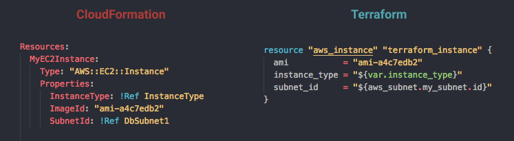

# Terraform VS. CloudFormation

[CloudFormation](https://aws.amazon.com/tw/cloudformation/) 是 [AWS][aws] 原生的 infrastructure as code 服務，你可以透過 JSON、YAML 格式佈署 AWS 服務，

## 差異比較表

比較項目     | Terraform | CloudFormation | 作者評論
----------- | -------- | ------- | ---  
支援平台    | **非常多** | AWS | 
原廠支援    | [HashiCorp][hashicorp] | **AWS** |  CloudFormation 親生富爸爸未來發展較好
雲服務支援   | 依靠社群，服務支援較慢 | **原生雲服務支援較快** | 新服務由 CloudFormation 最快，若是 Feature 則不一定。
語言 | HCL | YAML、JSON |
現有 Legacy 移轉  | **可匯入現有資源** | 必須重建 | 現有資源或手動修改 Terraform 透過 import 處理。
Rollback | 無 | **有** | CloudFormation 可以自行 Rollback 上一版。
差異比較 | 有 | 有 |
Cross Regions | 變數實現 | StackSet |
Deployment Locking | DynamoDB | **內建** |
Metadata State | **支援多種類型** | S3 |
Destry Protection | 有 | 有 |
模組化概念 | [Module Registry][terraform-registry] | [Stack][cloudformation-stacks] | Terraform 有版本的概念，CloudFormation 必須自行處理模組版本問題
UI | CLI | CLI、Web Console |
其他 | 可支援 CloudFormation | [Stack Policy][cloudformation-stackpolicy]、[Event Trigger][cloudformation-event-trigger] |

---

Terraform 和 CloudFormation 兩者工具在功能上算是互補，擇一都會有部分的缺陷必須接受，兩者共用則可以參考「[Terraform 和 CloudFormation 組合技的技巧][terraform-and-cloudformation]」但是帶來的學習成本也是需要考量的點。

## 參考資料

- [Your Infrastructure as Code CloudFormation Vs Terraform?](https://hackernoon.com/your-infrastructure-as-code-cloudformation-vs-terraform-34ec5fb5f044)

[aws]: (https://aws.amazon.com/tw/)
[hashicorp]: (https://www.hashicorp.com/)
[terraform-registry]: (https://registry.terraform.io)
[cloudformation-stacks]: (https://docs.aws.amazon.com/AWSCloudFormation/latest/UserGuide/stacks.html)
[cloudformation-stackpolicy]: (https://docs.aws.amazon.com/AWSCloudFormation/latest/UserGuide/protect-stack-resources.html)
[cloudformation-event-trigger]: (https://docs.aws.amazon.com/AWSCloudFormation/latest/UserGuide/aws-resource-events-rule.html)

[terraform-and-cloudformation]: (https://shazi.info/terraform-%e5%92%8c-cloudformation-%e7%b5%84%e5%90%88%e6%8a%80%e7%9a%84%e6%8a%80%e5%b7%a7/)